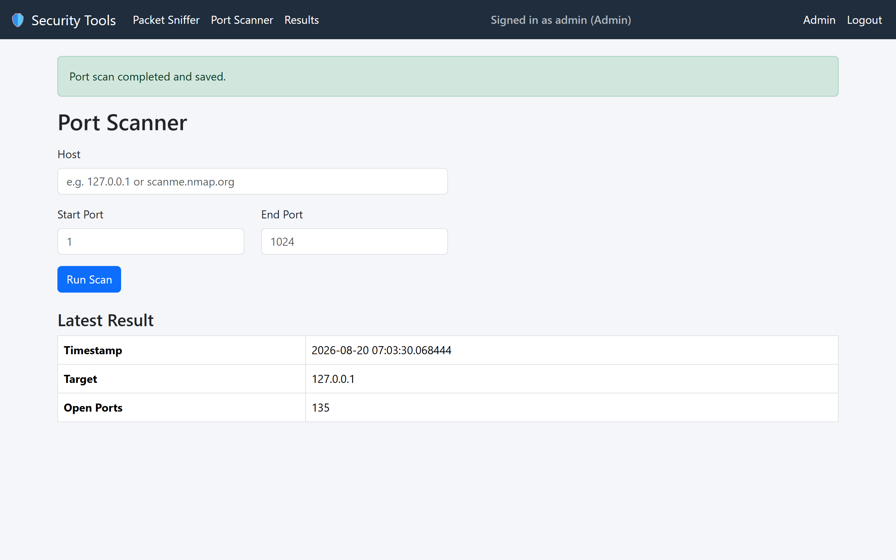
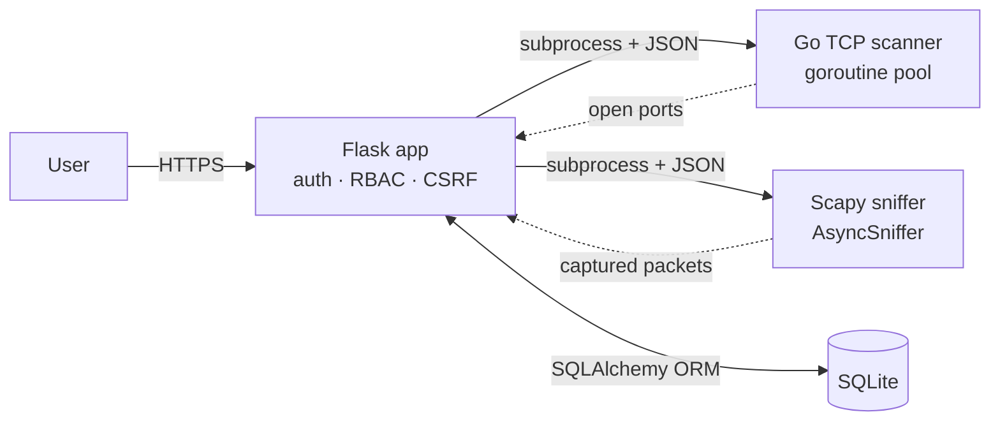
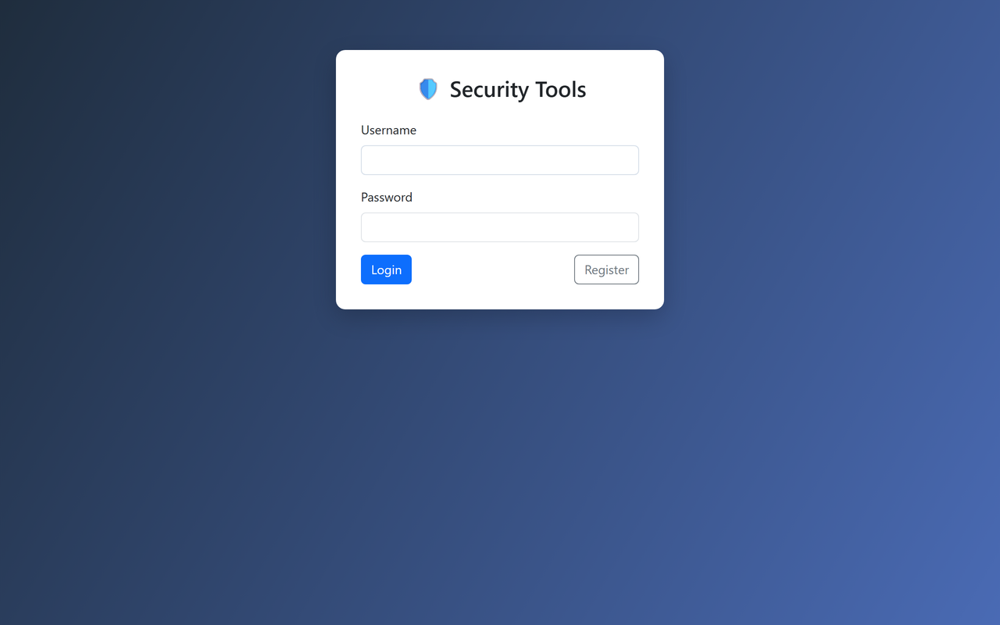
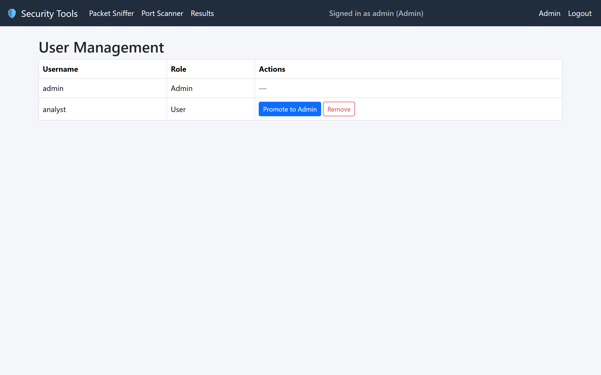

# 🛡️ Network Security Tools Dashboard

A Flask web dashboard that drives two purpose-built network tools — a **concurrent TCP port scanner written in Go** and a **Scapy packet sniffer written in Python** — behind role-based authentication, persisting every result to a database.

[](https://github.com/MikeRicketts/Security-Tools-Flask-App/actions/workflows/ci.yml)




## Why this project

It's a deliberately **polyglot** design: Python orchestrates and serves the UI, Go handles the performance-sensitive concurrent scanning, and Scapy does low-level packet capture. Each language is used where it's strongest, wired together over clean JSON boundaries and subprocess isolation.

## Architecture



The Flask layer never does network I/O itself. It validates input, shells out to the tool as a separate process (using argument lists, never a shell string), parses the tool's JSON, and stores it. That keeps the web tier simple and the tools independently testable and runnable.

## Features

- User registration, login, and logout with **bcrypt**-hashed passwords
- **Role-based access control** — only Admins can run the tools or manage users
- Go-based concurrent TCP port scanner with host/port validation
- Scapy packet sniffer with configurable interface and duration
- Persist, browse, and clear scan and capture results
- Admin panel to promote or remove users
- **CSRF protection** on every state-changing request (Flask-WTF)

## Security notes

Because this is a security tool, the app itself is built to a security baseline:

| Concern | Approach |
| --- | --- |
| Passwords | bcrypt hashing, never stored or logged in plaintext |
| Privilege escalation | Roles are never derived from user input; new accounts are always `User` and promoted explicitly |
| CSRF | Flask-WTF `CSRFProtect` on all forms |
| Command injection | Subprocesses invoked with argument lists, not shell strings |
| Secrets | `SECRET_KEY` and the initial admin password come from the environment; a strong random admin password is generated on first run if unset |
| Debug console | Werkzeug debugger is off unless `FLASK_DEBUG=1` is explicitly set |

## Quickstart

### Option A — Docker (recommended)

```bash
cp .env.example .env      # then edit SECRET_KEY / ADMIN_PASSWORD
docker compose up --build
```

Open http://localhost:8000 and log in as `admin`. Packet capture needs raw-socket
access — the compose file grants `NET_RAW`/`NET_ADMIN`; to sniff the host's traffic
rather than the container's isolated network, uncomment `network_mode: host` (Linux).

### Option B — Local development with [uv](https://docs.astral.sh/uv/)

Requires Python 3.11+ and Go 1.24+.

```bash
uv venv && uv pip install ".[dev]"
export SECRET_KEY=$(python -c "import secrets; print(secrets.token_hex(32))")
uv run python app.py
```

On first run the admin account is created and its password is printed to the console
(or set `ADMIN_PASSWORD` to choose your own).

## Running the tools

- **Port Scanner** — enter a host and a port range; the Go scanner connect-scans them concurrently and reports open ports.
- **Packet Sniffer** — choose an interface (optional) and a duration; requires root/`sudo` (Linux) or Npcap + an elevated shell (Windows).

## Testing

```bash
uv run pytest              # Python: auth, RBAC, privilege-escalation regression
cd tools/scanner && go test ./...   # Go: request validation and scan logic
```

CI runs both suites plus `go vet` on every push.

## Project structure

```
app.py              # application factory + admin bootstrap
config.py           # environment-driven config
extensions.py       # db, bcrypt, login manager, CSRF
models.py           # User, ScanResult, PacketSnifferResult
routes/             # auth, dashboard (tools + results), admin blueprints
tools/scanner/      # Go concurrent TCP scanner (+ tests)
tools/sniffer/      # Scapy packet sniffer
templates/          # Bootstrap + Alpine.js UI
tests/              # pytest suite
```

## Screenshots

| Login | Admin panel |
| --- | --- |
|  |  |

## ⚠️ Authorized use only

These tools scan hosts and capture traffic. Use them **only** against systems you own
or have explicit written permission to test. Unauthorized scanning or interception may
be illegal. This project is provided for educational and authorized security testing
purposes only.

## License

[MIT](LICENSE) © Michael Ricketts
